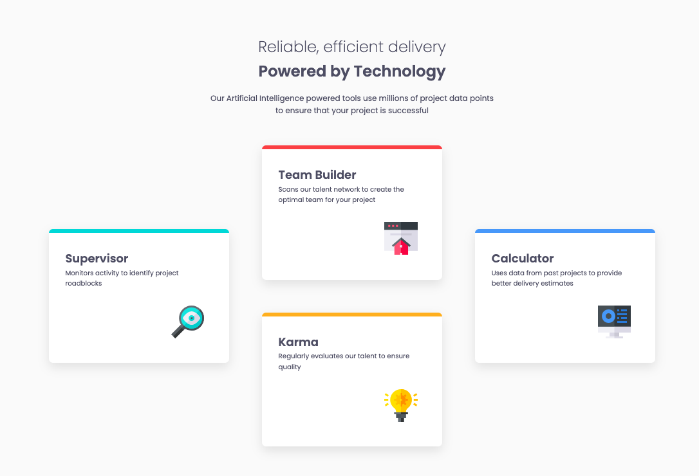

# Frontend Mentor - Four card feature section solution

This is a solution to the [Four card feature section challenge on Frontend Mentor](https://www.frontendmentor.io/challenges/four-card-feature-section-weK1eFYK). This challenge helped me practice responsive layouts, Flexbox, semantic HTML, and reusable CSS variables.

## Table of contents

- [Overview](#overview)
  - [The challenge](#the-challenge)
  - [Screenshot](#screenshot)
  - [Links](#links)
- [My process](#my-process)
  - [Built with](#built-with)
  - [What I learned](#what-i-learned)
  - [Continued development](#continued-development)
  - [AI Collaboration](#ai-collaboration)
- [Author](#author)
- [Acknowledgments](#acknowledgments)

**Note: Delete this note and update the table of contents based on what sections you keep.**

## Overview

### The challenge

Users should be able to:

- View the optimal layout for the site depending on their device's screen size

### Screenshot




### Links

- Solution URL: https://github.com/helmer12/four-card-feature-section
- Live Site URL: https://helmer12.github.io/four-card-feature-section/

## My process

### Built with

- Semantic HTML5 markup
- CSS custom properties
- Flexbox
- Responsive design
- Media queries


### What I learned

During this project, I practiced:

- Building responsive layouts with Flexbox
- Structuring semantic HTML elements correctly
- Using CSS custom properties for reusable styles
- Creating equal-height cards
- Improving accessibility with decorative images

One thing I found especially useful was using Flexbox to organize the card layout:

```css
main {
    display: flex;
    justify-content: center;
}

.middle {
    display: flex;
    flex-direction: column;
}
```

I also improved my understanding of responsive design using media queries:

```css
@media (max-width: 48rem) {
    main {
        flex-direction: column;
    }
}
```

### Continued development

In future projects, I want to continue improving:

- CSS Grid layouts
- Responsive design techniques
- Accessibility best practices
- Cleaner spacing systems


### AI Collaboration

I used ChatGPT as a learning assistant during this project to:

- Clarify Flexbox behavior
- Understand semantic HTML choices
- Improve accessibility practices
- Learn better responsive design techniques

The project structure, layout decisions, and final implementation were coded by myself.

## Author

- Frontend Mentor - [@helmer12](https://www.frontendmentor.io/profile/helmer12)
- GitHub - [helmer12](https://github.com/helmer12)

## Acknowledgments

Well, I am happy working with Frontend Mentor platform. Its fascinated the way I have been improving my skills on programming. So thank you Frontend.
